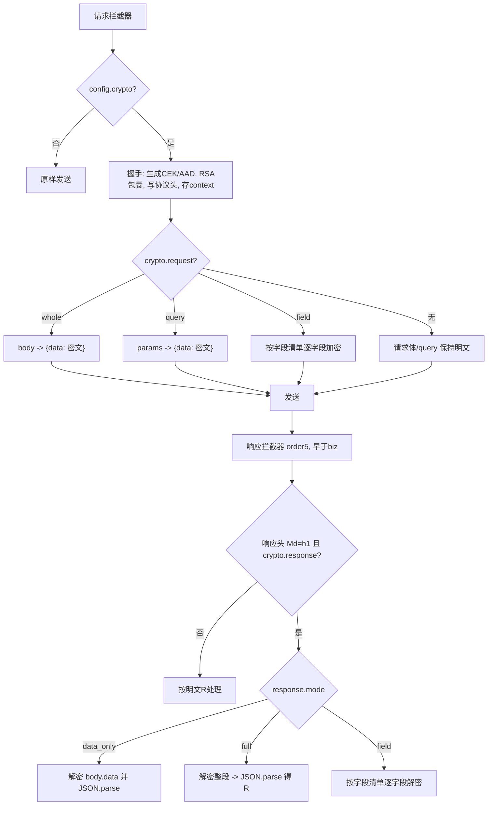

# 信封加密（Envelope Crypto）前端对接

本文说明前端信封加密（HYBRID）的实现原理、配置方式与内部流程。通用加解密能力沉淀在 `@ingot/shared/crypto` 包，`ingot-admin` 与 `ingot-login` 通过各自的 axios 拦截器接入，对业务代码透明。

## 1. 背景与原理

- 前端不保存任何长期对称密钥，仅缓存服务端公钥（可公开）。
- 每次请求随机生成一次性内容密钥 CEK（AES-256-GCM，32 字节）：
  - 用 CEK 加密请求内容；
  - 用服务端公钥 `RSA-OAEP-256` 包裹 CEK 放入请求头；
  - 在内存中保留该 CEK/AAD，用于解密本次响应。
- 应用层加密是对 HTTPS 的补充；传输层仍建议启用 HTTPS（见第 9 节内网部署说明）。

握手与协议头对所有模式完全一致，差异只在于“哪部分是密文”。

## 2. 加密模式（6 种粒度）

请求方向与响应方向相互独立，在请求创建时分别配置。

请求（前端加密、后端解密）：

- `whole`（整体请求体加密）：请求体形态为 `{"data":"<密文>"}`，密文是整段业务 JSON（POST 等）。
- `query`（URL 参数加密，GET）：`GET ?data=<密文>`，密文是整段业务 JSON，由 axios 对 query 值做 URL 编码（参数名默认 `data`，可通过 `paramKey` 与后端 `ingot.crypto.param-key` 对齐）。
- `field`（字段级加密）：正常业务 JSON，仅约定字段的值为密文（每字段独立 IV）。

响应（后端加密、前端解密）：

- `data_only`（默认）：`{"code","message","data":"<密文>"}`，解密 `data`；`code/message` 明文。
- `full`：整个响应体为密文，解密后得到完整 `R` JSON。
- `field`（字段级）：正常 `R` JSON，仅约定字段的值为密文。

要点：

- 密文格式统一为 `base64(IV[12] ‖ 密文 ‖ Tag[16])`。
- 所有模式复用同一 AAD：`h1|<kid>|<nonce>|<ts>`（请求加密与响应解密复用请求时生成的 nonce/ts）。
- 只要请求或响应任一方向需要加密，就必须在请求时握手并发送协议头（这样后端才有 CEK 加密响应）。
- 判断响应是否加密统一看响应头 `X-In-Crypto-Md` 是否为 `h1`。

## 3. 协议头

请求头：

- `X-In-Crypto-Md`：`h1`，触发信封加密。
- `X-In-Crypto-Kv`：`<kid>`，使用的公钥版本。
- `X-In-Crypto-Sk`：`base64(RSA-OAEP-256(CEK))`，被包裹的 CEK。
- `X-In-Crypto-No`：随机串，防重放 nonce（每请求唯一）。
- `X-In-Crypto-Ts`：毫秒时间戳，防重放。
- `X-In-Crypto-Al` / `X-In-Crypto-En`：可选，缺省 `RSA-OAEP-256` / `A256GCM`。

响应头：

- `X-In-Crypto-Md: h1` 表示响应体已加密。
- `X-In-Crypto-Kv: <activeKid>` 为服务端当前激活公钥版本，用于感知密钥轮换。

> 协议头名称可能被后端重命名，以联调为准。如需调整，改各应用 `src/net/crypto.ts` 中的 `cryptoHeaderNames` 即可。

## 4. 配置方式（业务用法）

在请求的 config 上声明 `crypto`，请求与响应方向可任意组合、可单独出现：

```ts
// 请求整体加密 + 响应 data 解密
Http.post(url, body, {
  crypto: { request: { mode: "whole" }, response: { mode: "data_only" } },
});

// 仅请求加密
Http.post(url, body, { crypto: { request: { mode: "whole" } } });

// 仅响应解密（FULL）
Http.get(url, params, { crypto: { response: { mode: "full" } } });

// GET：query 参数加密 + 响应 data 解密
Http.get(url, { foo: 1, bar: "x" }, {
  crypto: {
    request: { mode: "query" },
    response: { mode: "data_only" },
  },
});

// query 模式自定义参数名
Http.get(url, params, {
  crypto: { request: { mode: "query", paramKey: "data" } },
});

// 字段级（支持类型转换）
Http.post(url, body, {
  crypto: {
    request: { mode: "field", fields: ["password", "phone"] },
    response: { mode: "field", fields: [{ key: "roles", type: "array" }] },
  },
});
```

字段清单类型：

```ts
type CryptoFields = Array<
  string | { key: string; type?: "string" | "number" | "boolean" | "object" | "array" }
>;
```

- 字符串写法默认按 `string` 处理；对象写法可指定 `type`，字段级解密后会按 `type` 还原（number/boolean/object/array）。
- 字段清单“哪些字段是密文”由前后端按接口约定固定，前端建议将“接口 -> 字段清单”配置化。

所有加解密统一使用信封加密（`config.crypto`），不再使用固定密钥 `VITE_APP_AES`。

## 5. 内部流程



关键点：

- FULL 响应下 `code` 也是密文，解密必须早于业务拦截器（`ingot-admin` 中响应信封拦截器 `order = 5`，早于 `biz` 的 `order = 10`；`ingot-login` 中在 `axiosResponseToR` 拍平前解密）。
- 仅响应加密时请求体/query 保持明文，但仍握手发送协议头以携带 CEK。
- `query` 模式加密 `config.params`（`Http.get(url, params)` 合并后的对象），密文由 axios 序列化时 URL 编码，勿手动 `encodeURIComponent` 避免双重编码。

## 6. 公钥缓存与密钥轮换

公钥采用**双层缓存**，减少 `/crypto/public-keys` 请求：

1. **内存**：`CryptoKey` 对象，页面存活期间复用。
2. **sessionStorage**（各子域独立）：存 `{ kid, publicKey, alg }` 的 JSON，刷新页面后先读 sessionStorage 再 `importKey`，避免重复拉取。

存储键名：`${VITE_APP_STORE_PREFIX}:crypto:public-key`（如 `__ingot__:crypto:public-key`）。

注意：

- sessionStorage 按 **origin（协议+主机+端口）** 隔离，`login.ingotcloud.top` 与 `admin.ingotcloud.top` 各自缓存，**不能跨子域共享**（也不会像 Cookie 那样随每个 API 请求自动携带）。
- 不使用 Cookie 存公钥，避免每个接口请求都带上公钥数据。

轮换与容错（内存 + sessionStorage 同步更新）：

- 无需轮询。同子域内刷新页面可复用 sessionStorage 中的公钥。
- 被动感知：任一加密响应头 `X-In-Crypto-Kv` 与本地 `kid` 不同，异步 `refresh()` **强制走网络**拉取并写回 sessionStorage（`refresh()` 会先清除 sessionStorage，避免读到旧 kid）。
- 错误兜底：收到 `crypto_kid_unknown` 时 `refresh()`，用保留的原始明文重新握手加密，经无拦截器实例重试一次。
- 服务端轮换时会保留旧 kid 一段时间（新旧并存），切换对用户无感。

常见错误码（明文 `R.code`）：`crypto_header_missing`、`crypto_kid_unknown`、`crypto_key_unwrap_error`、`crypto_integrity_error`、`crypto_alg_unsupported`、`replay_ts_expired`、`replay_nonce_dup`。

## 7. 代码结构

`@ingot/shared/crypto`（`packages/shared/src/crypto/`，无 HTTP 依赖）：

- `provider.ts`：检测 Secure Context，原生 `crypto.subtle` 不可用时懒加载 `webcrypto-liner/build/index.es.js` 独立实例。
- `aes-gcm.ts`：AES-256-GCM 加解密（内部随机 IV），输出/解析 `base64(IV‖密文‖Tag)`。
- `rsa-oaep.ts`：导入 X509(SPKI) 公钥、`RSA-OAEP-256` 包裹 CEK。
- `fields.ts`：字段级深度遍历加解密 + 类型转换。
- `key-store.ts`：`KeyStore` 公钥内存 + sessionStorage 双层缓存与轮换，公钥拉取由使用方注入。
- `envelope.ts`：`createEnvelopeSession`（握手）、`encryptRequestContent` / `applyEncryptedRequest`、`decryptResponseBody`、`buildAad`。
- `types.ts`：模式/字段/配置类型、协议头名、错误码。

应用接入：

- `ingot-admin`：`src/net/crypto.ts`（KeyStore/头名/原始实例）、`src/net/interceptor/request/envelope.ts`、`src/net/interceptor/response/envelope.ts`。
- `ingot-login`：`src/net/crypto.ts`、`src/net/interceptor/request.ts`、`src/net/interceptor/response.ts`。

公钥端点：`GET /crypto/public-keys`（匿名可访问），返回 `active=true` 的 `{kid, publicKey}` 并缓存。

## 8. WebCrypto 关键参数

- 包裹：`{ name: "RSA-OAEP", hash: "SHA-256" }`（MGF1 亦为 SHA-256）。
- 内容：`{ name: "AES-GCM", iv, additionalData: AAD, tagLength: 128 }`；密钥 `importKey` 为 256 位。
- 输出拼接：`IV(12) ‖ ciphertextWithTag`（GCM 密文末尾已含 16 字节 tag），再 `base64`。

## 9. 内网 HTTP 与 WebCrypto 降级

### 9.1 问题本质

浏览器限制的是 **Secure Context**（安全上下文），与是否能访问互联网无关：

| API | `http://192.168.x.x` | `https://...` / `localhost` |
|-----|----------------------|-------------------------------|
| `crypto.getRandomValues` | 可用 | 可用 |
| `crypto.subtle` | **不可用** | 可用 |

纯 HTTP 内网 IP 访问时，若直接调用 `crypto.subtle`，信封加密会在握手阶段失败。

### 9.2 自动降级机制

`@ingot/shared/crypto` 通过 `provider.ts` 自动选择实现：

1. **Secure Context**（HTTPS / localhost）：使用浏览器原生 `crypto.subtle`，无额外体积。
2. **非 Secure Context**（HTTP 内网 IP）：首次需要加解密时，动态 `import("webcrypto-liner/build/index.es.js")` 获取独立 `Crypto` 实例（不替换 `window.crypto`，避免 `delete self.crypto` 在部分浏览器失败），由其实现提供完整 `SubtleCrypto`（RSA-OAEP-256、AES-256-GCM + AAD），算法参数与原生路径一致。

诊断 API（可从 `@ingot/shared/crypto` 导入）：

```ts
import { isNativeSubtleAvailable, isCryptoSupported } from "@ingot/shared/crypto";

isNativeSubtleAvailable(); // 是否走原生 subtle
isCryptoSupported();       // 信封加密是否可用（含降级）
```

降级包会单独 code-split（约 45KB gzip），仅 HTTP 环境按需加载。

### 9.3 安全边界

- **Polyfill 解决的是浏览器 API 限制**，不是传输层加密。HTTP 下未走信封加密的流量（普通 GET、响应 `code/message`、Cookie/Token 等）仍为明文。
- **仍建议内网部署 HTTPS**（自签证书 / 内网 CA + Nginx 终结 TLS）作为纵深防御。
- 若客户环境完全无法上 HTTPS 且接受传输明文风险，polyfill 是让密码等敏感字段继续走信封加密的兼容手段，需与后端、安全评审对齐。

### 9.4 推荐部署优先级

1. **首选**：内网 HTTPS（改动最小、安全最好）。
2. **兜底**：HTTP + WebCrypto 降级（本方案），保证 `config.crypto` 接口可用。
3. **可选后续**：全局开关 `VITE_APP_CRYPTO_ENABLED` 在内网关闭信封加密（需后端配合）。
