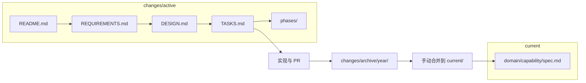

# ingot-admin SDD（规格驱动开发）

本目录存放产品/能力规格与变更提案，与工程文档（`docs/`）、AI 编码规范（`.agents/skills/`）互补。

## 目录结构

```text
specs/
├── README.md                 # 本文件：工作流与命名约定
├── CONSTITUTION.md           # 项目不可协商原则
├── current/                  # 当前系统真相（source of truth）
│   └── <domain>/
│       └── <capability>/
│           ├── README.md     # 能力索引与变更记录
│           └── spec.md       # 当前生效规格
├── changes/
│   ├── active/               # 进行中的变更
│   │   └── <change-id>/
│   └── archive/              # 已完成变更（按年归档）
│       └── <year>/
│           └── <change-id>/
└── templates/                # 文档模板（复制后填写）
    ├── current/
    └── change/
```

## 与其他文档的关系

| 路径 | 用途 |
|------|------|
| `docs/` | 工程/运维指南（构建、CI、TS 配置） |
| `specs/` | 产品/能力规格与变更（SDD） |
| `.agents/skills/` | AI 编码规范（实现层约束） |
| `apps/ingot-admin/src/pages/platform/*/README.md` | 源码目录导航（可链接到 `current/`） |

## 域（domain）命名

与现有业务域对齐，使用小写 kebab-case：

| domain | 说明 |
|--------|------|
| `base` | 平台配置（应用、菜单、权限、角色、字典等） |
| `admin` | 后台管理 |
| `member` | 会员管理 |
| `develop` | 开发工具 |
| `aam` | AAM 模块 |
| `common` | 跨域公共能力 |
| `org` | 组织架构 |
| `ingot-login` | 登录应用 |
| `packages` | 共享包（utils、hooks 等） |

`capability` 为域下的具体能力，如 `role-management`、`menu-management`。

## 变更 ID 命名

```text
<YYYYMMDD>-<domain>-<feature>
```

示例：`20250613-base-role-data-permission`

- 日期：变更创建日
- domain：主要影响域
- feature：简短英文描述，用连字符分隔

## 变更目录结构

在 `changes/active/` 下创建变更目录，从 `templates/change/` 复制模板：

```text
changes/active/<change-id>/
├── README.md           # Proposal：动机、范围、排除项
├── REQUIREMENTS.md     # 可验收需求（含 ADDED/MODIFIED/REMOVED）
├── DESIGN.md           # 技术方案与架构决策
├── TASKS.md            # 实现任务清单
└── phases/             # 可选：大功能分阶段任务
    └── phase-01-<name>/
        └── TASKS.md
```

### 文档职责

| 文件 | 职责 |
|------|------|
| `README.md` | **Proposal**：为什么做、做什么、不做什么、风险与依赖 |
| `REQUIREMENTS.md` | **需求**：结构化需求与验收标准；用 ADDED/MODIFIED/REMOVED 标记相对 `current/` 的变化 |
| `DESIGN.md` | **设计**：技术方案、数据模型、API/组件影响、符合 CONSTITUTION 的检查 |
| `TASKS.md` | **任务**：可勾选实现清单 |
| `phases/` | **分阶段**：复杂变更按阶段拆分任务（见 `templates/change/phases/README.md`） |

## 工作流

```text
1. 复制 templates/change/ → changes/active/<change-id>/
2. 填写 README.md（明确动机与范围）
3. 填写 REQUIREMENTS.md（需求与验收标准）
4. 填写 DESIGN.md（技术方案）
5. 填写 TASKS.md（任务拆解；大功能可拆 phases/）
6. 实现代码并关联 PR
7. 验收通过后归档（见下方）
```



## 归档流程

变更完成并合并代码后：

1. **合并规格**：将 `REQUIREMENTS.md` 中 `## ADDED`、`## MODIFIED` 的内容合并到对应 `current/<domain>/<capability>/spec.md`；`## REMOVED` 的内容从 `spec.md` 中删除
2. **移动目录**：将整个变更目录移至 `changes/archive/<year>/<change-id>/`
3. **更新索引**（可选）：在 `current/<domain>/<capability>/README.md` 记录变更 ID 与日期

若 `current/` 中尚无对应 capability，先从 `templates/current/` 复制创建。

## 新建能力规格

```bash
# 示例：为 base 域下的 role-management 创建规格
mkdir -p specs/current/base/role-management
cp specs/templates/current/README.md specs/current/base/role-management/
cp specs/templates/current/spec.md specs/current/base/role-management/
```

## 新建变更

```bash
# 示例
CHANGE_ID=20250613-base-role-data-permission
mkdir -p specs/changes/active/$CHANGE_ID/phases
cp specs/templates/change/README.md specs/changes/active/$CHANGE_ID/
cp specs/templates/change/REQUIREMENTS.md specs/changes/active/$CHANGE_ID/
cp specs/templates/change/DESIGN.md specs/changes/active/$CHANGE_ID/
cp specs/templates/change/TASKS.md specs/changes/active/$CHANGE_ID/
cp specs/templates/change/phases/README.md specs/changes/active/$CHANGE_ID/phases/
```

## 原则

实现前请阅读 [CONSTITUTION.md](./CONSTITUTION.md)。所有变更的设计与任务须符合项目不可协商原则。
